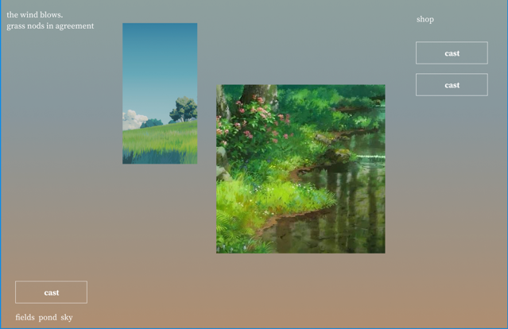

# PRD: Multiple Minigames

## Context

This PRD seeks to bring this game to date with the implementation described in the attached `bird_minigame.md` prd, namely the concepts of tabs for different minigames.
This change will introduce a change in site layout and new mechanics.

## Requirements

### Layout



The attached image will be an outline for the new site layout.

```
   ┌──────────────────────────────────────────────┐
   ├────────────────┐                             │
   │     eventLog   │                      shop   │
   ├────────────────┤                             │
   │                                              │
   │                                              │
   ├──────────────────────────┐                   │
   │     actionButton         │                   │
   ├──────────────────────────┤                   │
   │ fields  │  pond  │  sky  │                   │
   └──────────────────────────┴───────────────────┘
```

- Event log
  - Logs all story events to the player
  - Goes in the top left
- ActionButton
  - Corresponding button and info goes in the bottom right
  - Tabs at the bottom switches the corresponding button and view
- Shop
  - Ever present, located in the top right

### Mechanics

- fields
  - A single button "wind" on a 5 second cooldown
  - Each press grants a 10 currency
- pond
  - Fishing minigame that already exists on the codebase
  - Only one Rod Row
- sky
  - Bird watching minigame as described in the bird PRD

## Solution

### One clock for every cooldown

Everything in `PondView.tsx` today is driven by `requestAnimationFrame` loops living inside a
mounted `RodRow` — the cast tween, the luring reel, the fight tick. Under the old single-tab layout
that was harmless, because the pond was the only thing on screen. It stops being harmless the moment
`pond` is one of four tabs: a `RodRow` is a React component, and an unmounted component's `rAF`
simply doesn't fire. If switching to `fields` or `sky` unmounts `PondView`, a cast in flight, a fish
mid-bite, or a fight in progress freezes the instant you look away and either resumes exactly where
it left off (state was merely paused, not lost) or — worse — resets, depending on what unmounted.
Neither is acceptable: **the fishing lifecycle is real regardless of which tab is visible**, the same
way a real fish doesn't stop pulling because you glanced at the shop.

Two different fixes cover the two different shapes of state in this PRD:

- **State with continuous, input-dependent physics** — the cast tween, the luring reel's
  accel/decel, the fight's tension — doesn't have a clean closed form once you factor in that the
  player might have been reeling for part of the elapsed time. The pragmatic fix is to stop
  unmounting it: `ActionsSection`'s `pond` `Tabs.Content` uses Radix's `forceMount` and is hidden
  with CSS instead of being torn down, so `PondView`'s single `RodRow` keeps its `rAF` loop running,
  invisibly, for exactly as long as it would if the tab were still selected. Nothing about `RodRow`'s
  internals has to change — the fix is entirely "stop destroying it," not "rewrite it to be
  time-pure."
- **State with no continuous input** — `fields`' cooldown, each bird's landed/away cycle — has no
  physics to lose, so it doesn't need to stay mounted to stay correct. These use a
  **timestamp comparison against `Date.now()`** instead: a store holds _when something becomes true_
  (`readyAt`, a bird's landing anchor), and any component asks "is it true yet?" by comparing to now,
  whenever it happens to render. This is simpler than `forceMount`-and-hide, so it's the default for
  anything new that doesn't already carry `RodRow`'s continuous-physics baggage.

`DelayButton` and `ChargeButton` don't fit this: they measure elapsed hold/charge time on a button
that only exists while pressed, so they keep their own `Date.now()` + `rAF` bookkeeping local to the
component. `fields` and `sky` get a new shared component, `CooldownButton` (`src/components/`,
alongside them), for the shape both need: press it, the action fires immediately, then it's
disabled and visibly refilling until a stored `readyAt` timestamp passes.

```ts
// CooldownButton.tsx (shape, not final code)
interface CooldownButtonProps {
  readyAt: number; // ms epoch; caller owns this, not the button
  onFire: () => void; // called immediately on a valid press
  cooldownMs: number; // for computing fill % from readyAt
  children: ReactNode;
}
```

The button doesn't own the cooldown — it just renders one. That's what lets both `fields` (a single
global cooldown) and `sky` (a cooldown plus ten independent bird timers) share it.

### The shop stops being a tab

Right now `ShopView` is one of three `Tabs.Content` panes in `ActionsSection.tsx`, gated behind
`shopUnlocked`. The new layout (`img.png`) makes the shop permanent chrome in the top-right,
visible regardless of which minigame tab is active — you should be able to glance at what you're
saving for while fields, pond, or sky is open.

`ActionsSection` splits in two:

- **`ActionsSection`** keeps only the three minigame tabs the mockup shows — `fields`, `pond`, `sky`
  — and moves `Tabs.List` below `Tabs.Content` to match the mockup's tab-bar-at-the-bottom layout.
  The existing `dream` tab is removed along with it.
- **A new top-level slot in `App.jsx`**, alongside `EventView` and `InventoryView`, renders
  `ShopView` unconditionally once `shopUnlocked`. That unlock check (currently computed inline in
  `ActionsSection`) moves to a small selector so both `App.jsx` and `ActionsSection` can use it
  without duplicating the threshold logic.

`EventView` doesn't move — it's already top-left, which is what the mockup asks for.

### `fields`: the cheapest possible action

A `fieldsStore.ts` holding one field, `readyAt: number` (default `0`, i.e. always ready). `wind()`
checks `Date.now() >= readyAt`, calls the existing `addMoney(FIELDS_WIND_REWARD)` from
`playerStore.ts`, and sets `readyAt = Date.now() + FIELDS_WIND_COOLDOWN_MS`. `FieldsView.tsx` is a
`CooldownButton` labeled "wind" and nothing else. Two constants land in `constants.ts`:
`FIELDS_WIND_COOLDOWN_MS = 5000` and `FIELDS_WIND_REWARD = 10`.

No new currency, no new store shape beyond one timestamp — `fields` is deliberately the simplest
tab in the game, since its entire job is to give the player something to do with idle clicks that
isn't fishing.

### `pond`: one rod, period — and the `ROD_SLOT` upgrade goes away

"Only one Rod Row" means what it says: it is no longer possible for two rods to be fishing at once.
That removes the entire premise of the `ROD_SLOT` shop upgrade — its only effect
(`upgradeStoreFactory.ts`'s `StatName.ROD_SLOT` case calling `setRodSlotCount(1 + level *
valuePerLevel)`) is to grow `rodSlotAssignments`/`rodSlotItems` so `PondView` mounts more concurrent
`RodRow`s. With concurrency gone, buying it would spend currency on a second slot that can never do
anything a first slot couldn't, which is worse than useless — it's a trap purchase. The upgrade is
removed outright, not disabled: `INITIAL_PLAYER_STATE` already defaults `rodSlotAssignments`/
`rodSlotItems` to length `1`, so with nothing left that ever calls `setRodSlotCount`, the player
simply always has exactly one rod slot, which is precisely "only one Rod Row."

`PondView` itself needs no change beyond that — `Array.from({ length: rodCount })` already renders
one `RodRow` when `rodCount` is `1`. The fishing-lifecycle fix above (keeping `pond`'s `Tabs.Content`
`forceMount`ed) still applies unchanged: the one rod a player has keeps casting/luring/fighting
across a switch to `fields` or `sky`, it just never has a sibling rod to run alongside it.

### `sky`: a flock that needs no ticker

The bird PRD's `BirdFlock` is a per-frame simulation object precisely because Unity has no other way
to keep something progressing while off-screen. Here, the same trick that makes `fields`' cooldown
tab-switch-safe makes the whole flock tab-switch-safe for free, and it's simpler than the Unity
version: **a bird's on/off-ground state is a pure function of elapsed wall-clock time**, so there's
nothing to tick — the answer is derived at render time, not accumulated frame by frame.

`birdStore.ts` holds, for all ten birds: a fixed `cycles: number[]` (lerped `birdCycleMax`→
`birdCycleMin` exactly as in the bird PRD) and a mutable `anchors: number[]` — the timestamp each
bird's away-phase last began — plus one `observeReadyAt: number` for the shared 30s cooldown. A
bird is landed at time `t` when `(t - anchors[i]) mod (2 * cycles[i]) >= cycles[i]` (away for the
first half of its period, landed for the second). Initial anchors are staggered the same way the
bird PRD staggers its starts, so the flock trickles in rather than landing at once at `t = 0`.

`landedCountAt(t)` and the payout formula (`feathers = round(n × (1 + 0.2 × (n − 1)))`, same
constant, same curve) are plain functions over that state — no subscription, no loop. `SkyView.tsx`
calls them inside its own `rAF` loop purely to animate (recomputing which of the ten squares are
"up" every frame, the same way `PondView` already recomputes reel distance every frame), not to
advance any state. If `SkyView` isn't mounted, the birds are still exactly where the math says they
are the next time it is.

`observe()` is the one write: for every bird landed at press-time, set `anchors[i] = now` (restarts
its away phase — the "scatter"); birds already away are untouched, matching the bird PRD. It also
pays out and sets `observeReadyAt = now + OBSERVE_COOLDOWN_MS`.

`SkyView` renders ten small squares (styled `div`s, not a prefab — this codebase has no 3D scene to
land them in) that toggle a landed/away class, plus a `CooldownButton` labeled "observe" wired to
`observe()`. No FSM, no fly-in/fly-out states for a first pass — a CSS transition on the landed class
is enough to keep ten squares from reading as a slide show, and can grow into something fancier once
the loop is proven fun, the same "phase 2 is a number, phase 3 is a world" progression the bird PRD
itself used.

### One wallet, no second currency

The bird PRD mints "Feathers" specifically because it was gated behind a shop that didn't exist yet.
That shop now exists and is ever-present in this layout, so `sky`'s payout goes straight into
`wallet` via the same `addMoney` `fields` uses. A second currency with nothing to spend it on is the
bird PRD's own flagged risk; there's no reason to inherit it now that there's a sink sitting right
there in the top-right corner. "Feathers" as a name/flavor can still show up in the event log line
sky posts on an observe — that costs nothing to keep or change later.

### Keeping the economy model honest

Per the sync rule in `CLAUDE.md`, here's the audit for this change:

- **`fields` and `sky` are new income the model doesn't know about.** `EconomyModel.ts` simulates
  the pond loop exclusively and reports `$`/s from fishing; it has no notion of idle-clicker income
  from other tabs. This is the same shape of gap the bird PRD flagged for feathers, except this
  income _does_ land in the same wallet the model is trying to predict. Left alone, the model will
  under-report real income once a player is switching tabs to farm `fields`/`sky` on the side. This
  PRD does not extend the model to account for it — the honest fix depends on how much attention a
  real player actually splits across tabs, which wants playtesting data, not a guess baked into the
  sim. Flagged here so it isn't silently wrong.
- **`rodCount` can never exceed `1` again, and the model needs to stop pretending otherwise.**
  Removing `ROD_SLOT` (see **pond** above) means `simulateEconomy` should stop letting its
  `rodCountRef` grow at all — the `StatName.ROD`/`StatName.ROD_SLOT` branches around
  `EconomyModel.ts:514–538` become dead code once that upgrade no longer appears in the shop data,
  and should be deleted rather than left to simulate a purchase the player can no longer make. Any
  parameter sweep or upgrade-path recommendation that currently steers a simulated player toward
  buying a second rod slot needs to stop doing so.
- **Bite probability, XP, and fight timing are untouched.** Nothing about `fields` or `sky` reaches
  into `FightEngine.ts`, `checkBite`, or lure XP, so `castBiteProbability`, `expectedLuringTime`, and
  the XP block in `simulateEconomy` need no changes.

### Assumptions and risks

- **`DreamShopView` loses its way in, not just its tab.** Removing the `dream` tab removes the only
  place `DreamShopView` was reachable from; this PRD doesn't give it a new home, so dream points
  become unspendable until a follow-up decides where that content goes (its own ever-present panel,
  a return as a tab, or somewhere else entirely).
- **Removing `ROD_SLOT` touches shop data, not just code.** The upgrade's row needs to come out of
  wherever the live shop CSV is sourced from — `CsvGenerator.tsx` currently emits a `"ROD_SLOT"` row
  — and out of `upgradeStoreFactory.ts`'s switch, or a stale row in hand-authored shop data could
  still be purchased and silently no-op instead of actually being unavailable.
- **A debug-persisted second rod slot must not be restorable.** `playerStore.ts`'s
  `restorePersistedRodSlots` can currently load a previously-saved `rodSlotAssignments`/
  `rodSlotItems` of length `> 1` from `localStorage` (debug-only, gated on `persistRodSlots`). With
  `ROD_SLOT` gone, "only one Rod Row" has to hold even for a player replaying an old debug save, so
  restore must truncate (or refuse) anything longer than length `1` rather than silently reviving a
  second slot. See Phase 3 below.
- **Cooldowns are wall-clock, so they run even when the tab (browser tab, not game tab) is
  backgrounded.** `rAF`-driven animation throttles or pauses when the page isn't visible, but the
  `readyAt`/`anchors` timestamps this design compares against don't — so a player who alt-tabs away
  mid-cooldown comes back to the correct state, just without having watched the fill animate. This
  is a feature for a passive minigame like `sky`, and worth knowing about for `fields`.
- **The flock's rhythm is deterministic**, same as the bird PRD's own note — fixed cycles and a
  fixed stagger mean a perfect observe schedule exists. Acceptable for a first pass; per-arrival
  jitter is the smallest fix if it goes rote.
- **Nothing here is persisted.** `fields`' `readyAt` and the bird flock reset on a page reload, same
  as the rest of run state; only `rodSlotAssignments`/`rodSlotItems` currently survive a refresh
  (`restorePersistedRodSlots`), and that's unrelated to this PRD.

## Implementation Plan

### Phase 1: Layout — shop off the tab bar

1. Extract the `shopUnlocked` computation out of `ActionsSection.tsx` into a small selector (e.g.
   `stores/shopStore.ts` or a shared `util/`) so it can be read from `App.jsx` too.
2. Render `ShopView` directly in `App.jsx`, gated on that selector, positioned top-right alongside
   `EventView`/`InventoryView`.
3. Remove the `shop` and `dream` `Tabs.Trigger`/`Tabs.Content` pairs from `ActionsSection.tsx`; move
   `Tabs.List` below `Tabs.Content` to put the tab strip at the bottom.
4. Add `fields` and `sky` triggers alongside the existing `pond` one (empty placeholder content for
   now), so the tab set is exactly `fields`/`pond`/`sky`.
5. Set `forceMount` on `pond`'s `Tabs.Content` and hide it with CSS (`data-state="inactive"`) instead
   of letting Radix unmount it, so `PondView` and everything under it keep running while another tab
   is selected.

Ends with the current game, just rearranged — no new mechanics yet.

### Phase 2: `fields`

1. Add `FIELDS_WIND_COOLDOWN_MS` and `FIELDS_WIND_REWARD` to `constants.ts`.
2. Add `stores/fieldsStore.ts`: `readyAt`, `canWind()`, `wind()` (calls `addMoney`, sets `readyAt`).
3. Add `components/CooldownButton.tsx`: fires `onFire` on press if ready, then renders a filling,
   disabled state until `readyAt` passes.
4. Add `components/FieldsView.tsx` wiring `CooldownButton` to `fieldsStore`; wire it into the
   `fields` tab's `Tabs.Content`.

Ends with a working idle-clicker tab.

### Phase 3: `pond` — remove `ROD_SLOT`, keep the lifecycle alive across tabs

1. Remove the `ROD_SLOT` upgrade from the live shop data source (`CsvGenerator.tsx` and/or any
   hand-authored shop CSV) and delete the `StatName.ROD_SLOT` case in `upgradeStoreFactory.ts`.
2. Delete the `StatName.ROD`/`StatName.ROD_SLOT` branches in `EconomyModel.ts` (around lines
   514–538) and drop `rodCountRef` in favor of a fixed rod count of `1`, updating anything in
   `simulateEconomy` that reads it accordingly.
3. Change `restorePersistedRodSlots` to truncate any restored `rodSlotAssignments`/`rodSlotItems`
   to length `1`, so a pre-existing debug save can never bring back a second rod slot.
4. Confirm, with Phase 1's `forceMount` in place, that `PondView`'s single `RodRow` keeps ticking
   while `fields`/`sky` is the active tab — no change to `PondView`/`RodRow` itself is otherwise
   required, since `Array.from({ length: rodCount })` already renders one row when `rodCount` is `1`.

Ends with exactly one rod, forever, and the model no longer describing a purchase that doesn't exist.

### Phase 4: `sky`

1. Add the Birds constants to `constants.ts`: `BIRD_COUNT` (10), `BIRD_CYCLE_MAX_MS`/
   `BIRD_CYCLE_MIN_MS`, `BIRD_STAGGER_MS`, `OBSERVE_COOLDOWN_MS`, `FEATHER_BONUS_PER_BIRD` (0.2).
2. Add `stores/birdStore.ts`: `cycles`, `anchors`, `observeReadyAt`; pure `landedAt(t)` /
   `landedCountAt(t)`; `observe()` (payout via `addMoney`, scatters landed birds, sets cooldown).
3. Add `components/SkyView.tsx`: ten squares driven by an `rAF` loop reading `landedAt(Date.now())`,
   plus a `CooldownButton` labeled "observe"; wire into the `sky` tab.
4. Add an observed-event line via `pushEvent`/`EventMsg`, mirroring how `PondView` posts
   `EventMsg.CAUGHT`/`EventMsg.ESCAPED`.

Ends with all three new tabs playable end to end.

## Test Plan

There's no test runner in this repo today (`package.json` has no `test` script), so verification is
manual against the dev server rather than an automated suite:

- **Layout:** with `shopUnlocked` true and false, confirm the shop appears/disappears top-right
  independent of which minigame tab is selected, and that switching tabs never hides or resets it.
- **`fields`:** press "wind", confirm `+10` lands in the wallet immediately and the button disables;
  confirm it re-enables after 5s; switch to `pond` mid-cooldown and back, and confirm the cooldown
  wasn't reset or extended by the tab switch.
- **`pond` — single rod:** confirm exactly one rod row ever exists, and that `ROD_SLOT` no longer
  appears in the shop's upgrade catalog at any wallet balance.
- **`pond` — debug save can't resurrect a second slot:** with `persistRodSlots` on, manually write a
  length-`2` `rodSlotAssignments`/`rodSlotItems` pair to the `debug_rod_slot_assignments` localStorage
  key, reload, and confirm the game comes up with exactly one rod slot rather than restoring both.
- **`pond` persistence, across tabs:** start a cast, switch to `fields` or `sky` and back, and confirm
  the cast/lure/fight state is exactly where it would be had the tab never changed — not paused, not
  reset.
- **`sky`:** watch the ten squares land and leave on their staggered cycles; confirm the number
  "landed" matches what pressing "observe" pays out; confirm observing scatters only the birds that
  were landed, and that already-away birds keep their own timing afterward; switch to `fields` during
  the 30s observe cooldown and back, and confirm both the cooldown and the birds kept progressing.
- **Economy model:** run the Model tab's parameter sweep and confirm no upgrade path ever recommends
  or references a second rod slot, and that the sim's reported `rate` matches a single-rod game.
